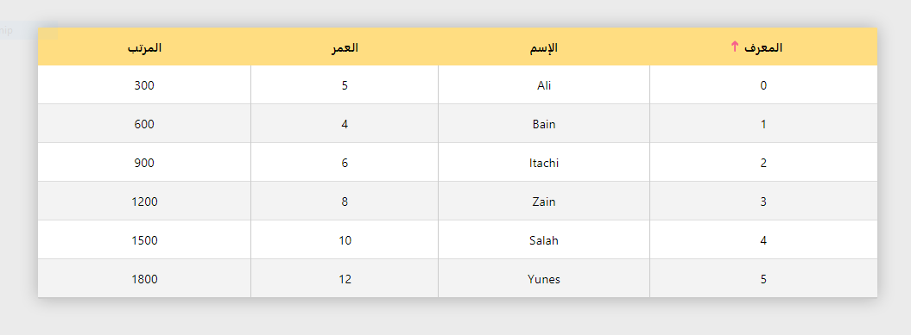

# JavaScrip DataGrid View


Easy and Customizable DataGridView Library.



<br>

# Usage

```html
<script src="./path/DataGridView.js"></script>
```

<br>

# To hot start just create instance.

```JavaScript
const dataGrid = new DataGridView(
    Array<Object>[dataSource],
    String[target],
    Array<String>[CustomHeaderText?](optional)
    );
```

## Example

```html
<div id='app'></div>
```


```JavaScript
const dataSource = [
    {
        Id: 1,
        Name: `Ali`,
        Age: 30,
    },
    {
        Id: 2,
        Name: `Ahmed`,
        Age: 25,
    },
    {
        Id: 3,
        Name: `Zain`,
        Age: 42,
    },

];

const dataGrid = new DataGridView(dataSource, '#app');
```

<br>

# Features
|Feature     |State       |
|:----------|:----------:|
|sort data   |true        |
|filter data |true        |
|pagenation  |soon        |
|lazy load   |soon        |
|fetch api   |soon        |
|customizable|true        |


<br>

# Methodss

| MethodName | Description |
|:----------|:-----------|
|LeftToRight(bool)|use it to set dataGridView layout dirction.|
|useGridLines(bool)|use it to show Grid lines between cells.|
|setStyle({css})|use it to modify css of dataGrid.|
|setDataSource([list of object])|use it to set dataSource to dataGridView.|
|getDataSource()|return current dataSource of dataGridView.|
|enableSorting()|use it enable sort feature by click on header cell.|
|alternativeRowHighLight()|use it enable alternative color for (even) row.|
|search(text, columnIndex)|filter data in dataGridView.|